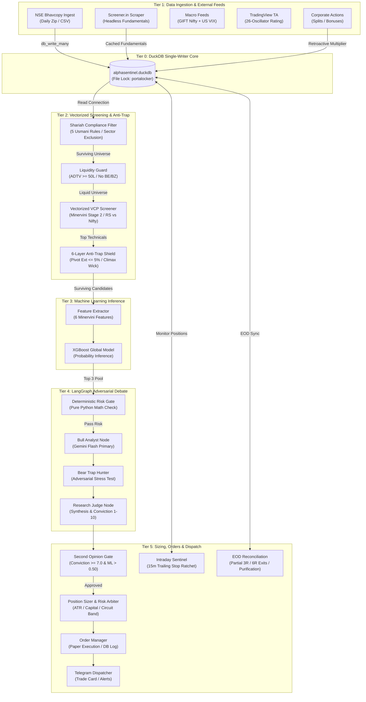
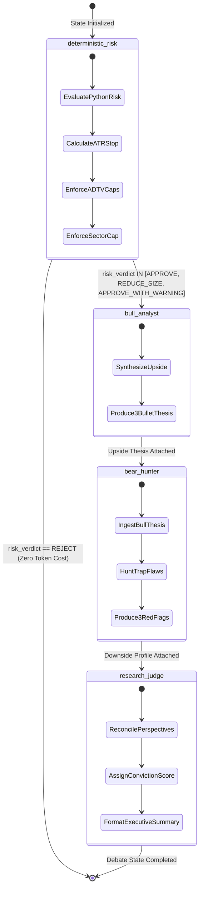
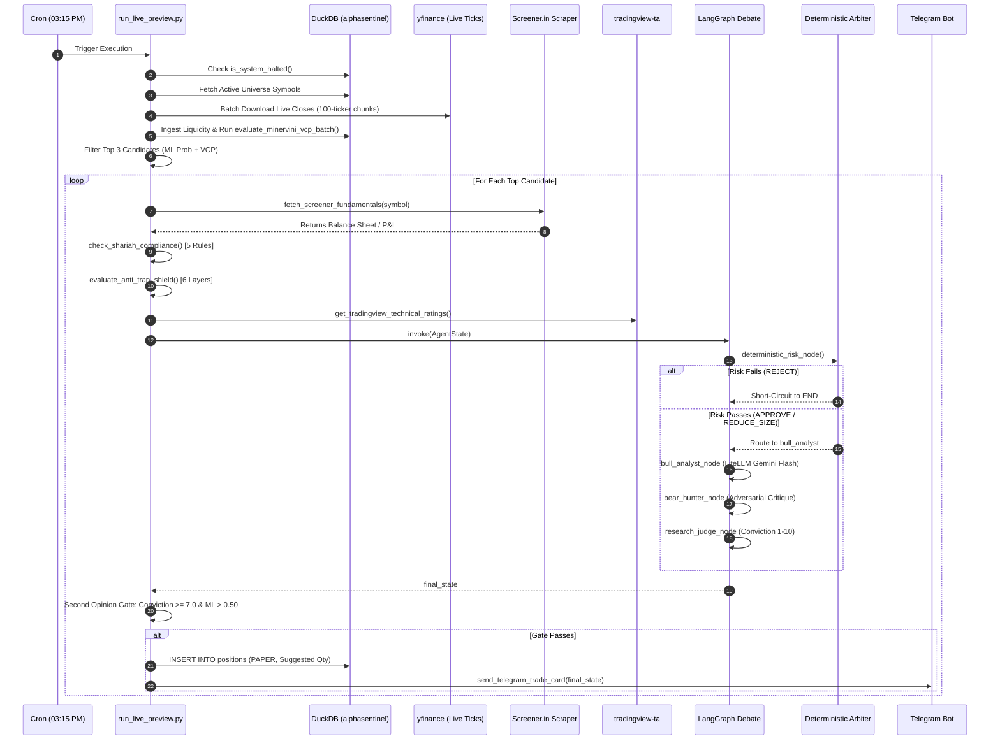
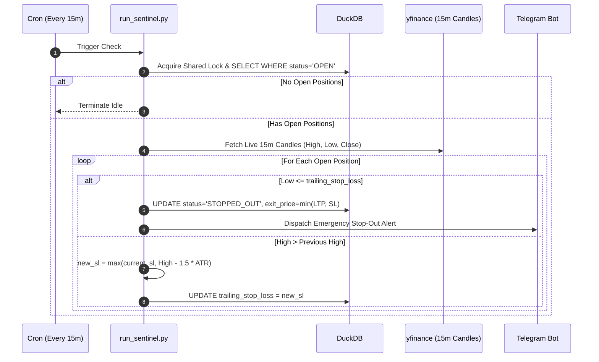
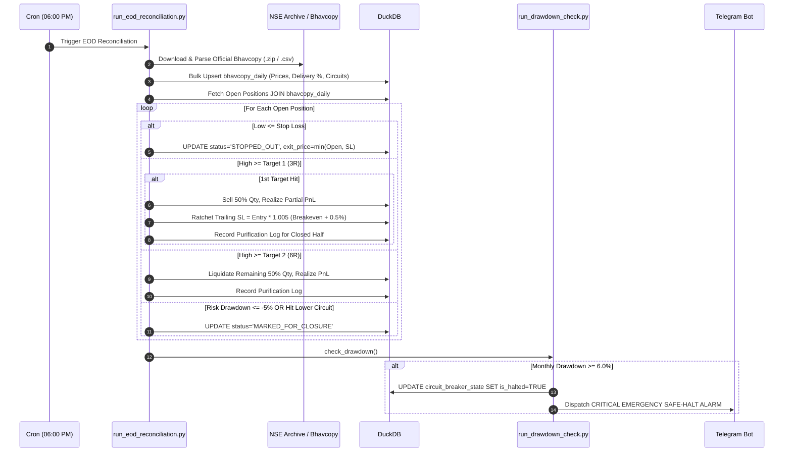

# AlphaSentinel OS: System Design & Architecture Specification (HLD & LLD)

> [!IMPORTANT]
> **CANONICAL ARCHITECTURAL REFERENCE & GOVERNANCE:**  
> This specification is the authoritative High-Level Design (HLD) and Low-Level Design (LLD) for the AlphaSentinel Personal Quantitative Trading & Advisory Operating System. It derives directly from the **Single Source of Truth Master PRD**: [`.agency/active/product_design/03_requirements_engineering.md`](file:///c:/Users/Md%20Ganim/Desktop/trading%20agents/.agency/active/product_design/03_requirements_engineering.md).
> All architectural patterns, data flow boundaries, database schemas, mathematical equations, and state transitions herein are reverse-engineered directly from the production codebase and aligned with the authoritative Shariah benchmark: `Copy of halal stock 2.0.xlsx` (Fatwa of Justice Mufti Muhammad Taqi Usmani).

---

## 1. Executive System Topology & Architecture Style

AlphaSentinel is architected as an institutional-grade, hybrid event-driven and batch-scheduled quantitative operating system. It executes on an autonomous, low-latency, zero-cloud-cost footprint (e.g., Oracle Cloud Infrastructure Always-Free ARM Architecture, 4 vCPUs, 24 GB RAM, or local bare-metal workstation).

```
+-------------------------------------------------------------------------------------------------------------+
|                                              ALPHASENTINEL OS TOPOLOGY                                      |
+-------------------------------------------------------------------------------------------------------------+
|  TIER 1: Ingestion & Market Feeds                                                                           |
|    - NSE Bhavcopy (HTTP/ZIP Scraper) -> jugaad-data / nsepy / yfinance fallback                             |
|    - Screener.in Stealth Scraper (Consolidated P&L, BS, Ratios, SQLite/DuckDB Cache)                        |
|    - Macro Feeds (yfinance: GIFT NIFTY Futures ^NSEI, US CBOE VIX ^VIX)                                     |
|    - TradingView Technical Ratings (tradingview-ta: 26 technical indicators)                                |
|    - Corporate Actions Ingestion (NSE splits, bonus adjustments)                                            |
+-------------------------------------------------------------------------------------------------------------+
                                       |
                                       v
+-------------------------------------------------------------------------------------------------------------+
|  TIER 2: Shariah Compliance & Quantitative Gating                                                           |
|    - Shariah Filter: 5-Rule Usmani Engine (Sector, Debt<=33%, Impure<=5%, Illiquid>=20%, NetLiquid<=MCap)   |
|    - Liquidity & Executability Guard: ADTV Tier Floor, Series BE/BZ Hard Block, Circuit Band Classification  |
|    - Vectorized Screener: Minervini Trend Template + VCP Contraction Ratio + NIFTY 500 Relative Strength    |
|    - 6-Layer Anti-Trap Shield: Pivot Extension (<=5%), Climax Wick, MA Guards, Pledge Trend, FOMO Saturation|
+-------------------------------------------------------------------------------------------------------------+
                                       |
                                       v
+-------------------------------------------------------------------------------------------------------------+
|  TIER 3: Quantitative Machine Learning Alpha Engine                                                         |
|    - XGBoost Global Classifier: 6 Strategy-Aligned Features (Sharpe Rank, Dist High, Regime, Rel RSI, etc.)|
|    - Monotonic Constraints & 5-Day Cross-Sectional Alpha Optimization                                       |
|    - Second Opinion Consensus Gate (Conviction Score >= 7.0 AND ML Probability > 0.50)                      |
+-------------------------------------------------------------------------------------------------------------+
                                       |
                                       v
+-------------------------------------------------------------------------------------------------------------+
|  TIER 4: LangGraph Multi-Agent Adversarial Debate Subsystem                                                 |
|    - Deterministic Risk Node (Pure Python Mathematical Gatekeeper - Zero LLM Authority)                    |
|    - Bull Analyst Node (Catalyst & Momentum Thesis Generation via LiteLLM Gemini Flash)                     |
|    - Bear Trap Hunter Node (Red Flag, Liquidity & Downside Stress Testing)                                  |
|    - Research Judge Node (Impartial Synthesis & Mathematical Conviction Scoring)                             |
|    - Checkpoint Recovery Engine (MemorySaver Thread Isolation & Token-Optimized State Passing)             |
+-------------------------------------------------------------------------------------------------------------+
                                       |
                                       v
+-------------------------------------------------------------------------------------------------------------+
|  TIER 5: Risk Arbiter, Execution & Notification Subsystem                                                   |
|    - Deterministic Risk Arbiter: ATR Volatility Sizing, ADTV Caps, Sector Caps, Macro Cash Factor           |
|    - Order Execution Manager: Limit Order Price-Chaser, 1.5x ATR SL, 3R / 6R Target Management             |
|    - Intraday Sentinel Daemon: 15-min Trailing Stop ratchet & Circuit Breaker Monitor                       |
|    - Database Concurrency: DuckDB Single-Writer Process Lock (`portalocker.Lock`)                           |
|    - Notification Dispatcher: Telegram Bot Async Queue (Trade Cards, Safe-Halt Alarms, Drawdown Alerts)     |
+-------------------------------------------------------------------------------------------------------------+
```

---

## 2. High-Level Design (HLD)

### 2.1 End-to-End Component Flowchart



---

## 3. Technology Decision Records (TDR)

| Architectural Domain | Selected Technology | Alternative Evaluated | Mathematical & Engineering Rationale | Accepted Trade-Off |
| :--- | :--- | :--- | :--- | :--- |
| **Database Engine** | **DuckDB (Embedded OLAP)** | PostgreSQL / SQLite / TimescaleDB | Columnar storage enables sub-5ms vectorized aggregation across 10 years of Bhavcopy (2M+ rows). Zero network socket overhead. $0 operational cost. | Strict single-writer concurrency limit; requires process-level locking via `portalocker`. |
| **Agent Orchestrator** | **LangGraph (StateGraph)** | CrewAI / AutoGen / Agno | Cyclic state machines with deterministic routing (`risk_router`), thread-level checkpointing (`MemorySaver`), and immutable state typing. | Higher boilerplate compared to lightweight multi-agent frameworks. |
| **LLM Gateway & Failover** | **LiteLLM Waterfall Client** | LangChain ChatOpenAI / Raw Requests | Universal OpenAI-compatible interface with automatic zero-cost waterfall: `Google Gemini 1.5 Flash (Free)` $\rightarrow$ `DeepSeek-R1 (OpenRouter)` $\rightarrow$ `Groq Llama-3.3` $\rightarrow$ `Deterministic Math`. | 15ms proxy routing overhead; free-tier rate limits require exponential backoff. |
| **ML Inference Engine** | **XGBoost (DART Booster)** | LightGBM / CatBoost / PyTorch MLP | Built-in monotonic constraints prevent unphysical predictions (e.g., higher distance from 52W high strictly penalizes score). Native pickle serialization. | Requires careful feature alignment during single-tick live inference. |
| **Technical Math Engine** | **Pandas + NumPy Vectorization** | VectorBT Pro / TA-Lib | Native vectorized rolling calculations (`rolling(window).mean()`, `ewm()`) operate in C without requiring external compiled C libraries (eliminates Windows MSVC build failures). | Memory-intensive during multi-ticker unstacking (contained within 24GB ARM RAM). |
| **Inter-Process Locking** | **`portalocker.Lock`** | Redis distributed locks / POSIX semaphores | Cross-platform file locking (works natively on both Windows and Linux/ARM) with atomic non-blocking timeout handling (`timeout=120`). | Lock contention between 15m Sentinel and 3:15 PM Screener if write durations exceed 500ms. |
| **Notification Bus** | **Telegram Bot API (python-telegram-bot)** | Webhooks / Discord / SMS | Free, encrypted, zero-maintenance mobile push notifications with interactive command polling (`/status`, `/positions`, `/halt`, `/resume`). | HTTP rate limit of 30 messages/second requires batching. |

---

## 4. Low-Level Design (LLD): Component Specifications

### 4.1 Tier 1: Ingestion & Market Feeds

#### 4.1.1 `src/ingestion/bhavcopy.py`
- **Purpose**: Daily automated ingestion of official NSE Bhavcopy, including delivery metrics, circuit bands, and trading series.
- **Key Methods**:
  - `fetch_bhavcopy_with_retry_and_fallback(target_date: date) -> pd.DataFrame`: Attempts direct HTTP download from NSE archive; cascades to `yfinance` daily download if archive is unavailable.
  - `ingest_bhavcopy_dataframe(df: pd.DataFrame, trade_date: date) -> int`: Parses, validates, and bulk-inserts OHLCV + Delivery records into `bhavcopy_daily`.
  - `safe_float(val: Any) -> Optional[float]`: Defensive casting ensuring `None` is returned on `NaN`, `"-"`, or parse errors (prevents DuckDB double binding crashes).
  - `safe_int(val: Any) -> Optional[int]`: Defensive casting for integer volumes and circuit band values.

#### 4.1.2 `src/ingestion/screener_scraper.py`
- **Purpose**: Headless fundamental extraction for Shariah screening, debt metrics, promoter holding, and quarterly trends with multi-tiered caching.
- **Key Methods**:
  - `fetch_screener_fundamentals(symbol: str) -> Dict[str, Any]`: Checks `fundamentals_cache` table first (7-day TTL). If stale or missing, scrapes `https://www.screener.in/company/{symbol}/consolidated/` using randomized User-Agents and jitter (1.0s - 3.5s). Falls back to standalone page on 404.
  - Financial Extraction Parsing:
    $$\text{Interest Income Ratio} = \frac{\text{Other Income}}{\text{Sales}} \quad (\text{Fallback to Interest if Other Income} \le 0)$$
    $$\text{Debt to Assets} = \frac{\text{Borrowings}}{\text{Total Assets}}$$
    $$\text{Illiquid Assets} = \text{Fixed Assets} + \text{CWIP} + \text{Inventories} + \text{Intangible Assets}$$
    $$\text{Illiquid Ratio} = \frac{\text{Illiquid Assets}}{\text{Total Assets}}$$
    $$\text{Net Liquid Assets} = \text{Total Assets} - \text{Illiquid Assets} - \text{Total Liabilities}$$
  - `scrape_screener_fundamentals(symbol: str)`: Backward-compatible alias.

#### 4.1.3 `src/ingestion/corporate_actions.py`
- **Purpose**: Ingestion of stock splits, bonus issues, and retroactive mathematical adjustment of historical prices.
- **Mathematical Multipliers**:
  - Stock Split: Multiplier $M = \frac{\text{Face Value New}}{\text{Face Value Old}} = \frac{\text{Ratio To}}{\text{Ratio From}}$
  - Bonus Issue: Multiplier $M = \frac{\text{Ratio From}}{\text{Ratio From} + \text{Ratio To}}$
  - Price Adjustment: $P_{\text{adjusted}} = P_{\text{raw}} \times M$
  - Volume Adjustment: $V_{\text{adjusted}} = \left\lfloor \frac{V_{\text{raw}}}{M} \right\rfloor$
  - Cumulative Tracker: $\text{split\_multiplier} = \text{split\_multiplier} \times M$
- **Key Methods**:
  - `record_corporate_action(symbol, action_type, ex_date, ratio_from, ratio_to) -> str`
  - `apply_pending_corporate_actions() -> None`: Atomic batch update of `bhavcopy_daily` for all dates prior to `ex_date`.

#### 4.1.4 `src/ingestion/macro_feeds.py`
- **Purpose**: Pre-market and live macro weather radar extraction.
- **Data Ingestion**:
  - GIFT NIFTY Futures (`^NSEI` or `NIFTY_F1`): Measures overnight gap sentiment.
  - CBOE VIX (`^VIX`): Global risk volatility proxy.
  - India VIX (`^INDIAVIX`): Domestic volatility proxy.
- **Weather Scoring Algorithm**:
  $$\text{Macro Score} = 0.50 \cdot \mathbf{1}_{(\text{Nifty} > 50\text{-DMA})} + 0.30 \cdot \mathbf{1}_{(\text{VIX} < 18.0)} + 0.20 \cdot \mathbf{1}_{(\text{FII Net Flow} > 0)}$$
  $$\text{Target Cash Exposure} = \begin{cases} 0\% & \text{if Macro Score} \ge 0.80 \\ 30\% & \text{if } 0.50 \le \text{Macro Score} < 0.80 \\ 60\% & \text{if } 0.30 \le \text{Macro Score} < 0.50 \\ 100\% & \text{if Macro Score} < 0.30 \text{ (Defensive Freeze)} \end{cases}$$

---

### 4.2 Tier 2: Screening & Pre-Flight Gating

#### 4.2.1 `src/screening/shariah_filter.py`
- **Authoritative Fatwa**: Justice Mufti Muhammad Taqi Usmani (`Copy of halal stock 2.0.xlsx`).
- **Core Rules**:
  1. **Prohibited Business Activity**: Rejects 28 core non-compliant sectors (Banking, NBFC, Insurance, Liquor, Tobacco, Gambling, Entertainment/Cinema, Pork, Advertising, etc.).
  2. **Debt to Assets**: $\frac{\text{Interest-Bearing Debt}}{\text{Total Assets}} \le 33.0\%$ (Strictly fails if `Total Assets` $\le 0$).
  3. **Impure Income Ratio**: $\frac{\text{Other Income}}{\text{Total Revenue}} \le 5.0\%$.
  4. **Illiquid Asset Proportion**: $\frac{\text{Fixed} + \text{CWIP} + \text{Inventories} + \text{Intangibles}}{\text{Total Assets}} \ge 20.0\%$.
  5. **Net Liquid Asset Rule**:
     $$\text{Net Liquid Assets} = (\text{Total Assets} - \text{Illiquid Assets}) - \text{Total Liabilities}$$
     $$\text{Condition: } \text{Net Liquid Assets} \le \text{Market Capitalization}$$
     *(If Net Liquid Assets per Share $\le$ Market Price, the stock passes).*
- **Failure Mode**: Fail-closed on missing data.

#### 4.2.2 `src/screening/liquidity_guard.py`
- **Purpose**: Micro-cap executability and operator trap protection.
- **Hard Filters**:
  - Series Hard Block: Immediate rejection of `BE` (Book Entry / Trade-to-Trade), `BZ`, or `T2T` series.
  - ADTV Floor by Market Cap Tier:
    - Large Cap ($\ge ₹20,000 \text{ Cr}$): $\text{ADTV}_{20\text{d}} \ge ₹5.0 \text{ Cr}$
    - Mid Cap ($₹5,000 \text{ Cr} - ₹20,000 \text{ Cr}$): $\text{ADTV}_{20\text{d}} \ge ₹1.5 \text{ Cr}$
    - Small Cap ($₹1,000 \text{ Cr} - ₹5,000 \text{ Cr}$): $\text{ADTV}_{20\text{d}} \ge ₹50 \text{ Lakhs}$
    - Micro Cap ($< ₹1,000 \text{ Cr}$): $\text{ADTV}_{20\text{d}} \ge ₹25 \text{ Lakhs}$
  - Circuit Band Classification: Tags stocks with daily price limits ($\le 2\%, \le 5\%, \le 10\%, \le 20\%$) to calculate gap-and-lock liquidity risk.

#### 4.2.3 `src/screening/vcp_screener.py`
- **Purpose**: High-performance vectorized Minervini Stage 2 Trend Template & Mark Minervini Volatility Contraction Pattern (VCP) detection.
- **Vectorized Technical Gates**:
  1. Price $> \text{SMA}_{10} > \text{SMA}_{21} > \text{SMA}_{50}$
  2. $\text{SMA}_{50}[t] \ge \text{SMA}_{50}[t-21]$ (50-day moving average must be sloping upward)
  3. Price $\ge 1.25 \times \text{Low}_{60\text{d}}$ (Minimum 25% advance off multi-month lows)
  4. Price $\ge 0.75 \times \text{High}_{60\text{d}}$ (Within 25% of multi-month highs)
  5. Contraction Volume Dry-up: $\text{Vol}_{5\text{d}} < 0.85 \times \text{Vol}_{20\text{d}}$
  6. Benchmark Relative Strength: $\text{RS}_{60\text{d}} = \text{Return}_{\text{Stock}, 60\text{d}} - \text{Return}_{\text{NIFTY 500}, 60\text{d}} \ge 0.0$

#### 4.2.4 `src/screening/anti_trap_shield.py`
- **Purpose**: 6-Layer pre-flight defense to reject distribution setups before LLM or ML invocation.
- **Layers**:
  - **Layer 1: Pivot Extension Trap**: $\frac{\text{LTP} - \text{Trigger Price}}{\text{Trigger Price}} \le 5.0\%$.
  - **Layer 2: Parabolic Climax Trap**: Rejects if 10-day run $> 40\%$ AND 1-day volume $> 3.0 \times \text{Vol}_{10\text{d}}$ AND Upper Wick $> 50\%$ of daily candle range.
  - **Layer 3: Moving Average Extension**: $\frac{\text{LTP} - \text{SMA}_{20}}{\text{SMA}_{20}} \le 15.0\%$ AND $\frac{\text{LTP} - \text{SMA}_{50}}{\text{SMA}_{50}} \le 30.0\%$.
  - **Layer 4: Promoter Pledge Trend**: Rejects if $\Delta \text{Pledge}_{3\text{m}} > 0.0\%$ (Any quarterly increase in promoter pledge).
  - **Layer 5: Valuation Disregard**: Pure momentum swing bypass (P/E multiples ignored).
  - **Layer 6: FOMO News Saturation**: Rejects if recent news count $\ge 3$ AND 3-day return $> 15.0\%$.

---

### 4.3 Tier 3: Quantitative Machine Learning Alpha Engine

#### 4.3.1 `src/screening/ml_features.py` & `scripts/run_model_training.py`
- **Model**: XGBoost Global Classifier with DART booster, shallow trees (`max_depth=4`, `n_estimators=150`, `learning_rate=0.03`).
- **Feature Vector**: Exactly 6 strategy-aligned features:
  1. `sharpe_rank`: Cross-sectional percent rank of 60-day Sharpe ratio ($\frac{\text{Mean Daily Return}}{\text{Std Dev Daily Return}} \times \sqrt{252}$). In live single-tick mode, mapped via logistic approximation: $\frac{1}{1 + e^{-\text{Sharpe}}}$.
  2. `dist_high`: $\frac{\text{Close}}{\max_{252}(\text{High})} - 1.0$ (Distance to 52-week high).
  3. `market_regime`: Binary indicator ($1$ if Benchmark $>$ 50-DMA, else $0$).
  4. `rel_rsi`: Relative RSI vs Benchmark: $\text{RSI}_{\text{Stock}, 14} - \text{RSI}_{\text{Benchmark}, 14}$.
  5. `ema_dist`: $\frac{\text{Close}}{\text{EMA}_{20}} - 1.0$ (Distance to 20-day exponential moving average).
  6. `vol_cluster`: 20-day rolling standard deviation of daily logarithmic returns ($\sigma_{20\text{d}}$).
- **Target Definition**: Forward 5-day return $\ge +1.5\%$ hurdle rate:
  $$y_i = \mathbf{1}\left(\frac{\text{Close}_{t+5}}{\text{Close}_t} - 1.0 > 0.015\right)$$
- **Validation Gate**: Out-of-sample ROC-AUC $> 0.53$ required before persisting model artifacts.

---

### 4.4 Tier 4: LangGraph Multi-Agent Adversarial Debate

#### 4.4.1 `src/agents/state.py` (TypedDict Schema)
```python
class AgentState(TypedDict):
    symbol: str
    scan_date: str
    current_price: float
    trigger_price: float
    adtv_20d: float
    circuit_band: float
    market_cap_tier: Optional[str]
    fundamentals: Dict[str, Any]
    macro_weather: Dict[str, Any]
    historical_memory: List[Dict[str, Any]]
    tv_technical_rating: Optional[Dict[str, Any]]
    messages: Annotated[Sequence[BaseMessage], operator.add]
    macro_context: str
    current_verdict: Optional[str]
    vcp_signal: bool
    ml_probability: float
    mr_signal: bool
    shield_passed: bool
    macro_regime_score: float
    bull_thesis: Optional[str]
    bear_risks: Optional[str]
    judge_synthesis: Optional[str]
    conviction_score: float
    clarification_count: int
    risk_verdict: Optional[str]         # APPROVE, APPROVE_WITH_WARNING, REDUCE_SIZE, REJECT
    suggested_shares: int
    stop_loss_price: float
    target_1_price: float
    target_2_price: float
    risk_reward_ratio: float
    portfolio_allocation_pct: float
    rejection_reason: Optional[str]
    telegram_card_markdown: Optional[str]
    manual_review_payload: Optional[str]
```

#### 4.4.2 `src/agents/debate_graph.py` (StateGraph Specification)


#### 4.4.3 `src/agents/llm_gateway.py` (Resilient Waterfall Client)
- **Model Roster**:
  - Primary: `gemini/gemini-1.5-flash` (AI Studio, 1M context, 15 RPM).
  - Fallback 1: `openrouter/deepseek/deepseek-r1` (OpenRouter API).
  - Fallback 2: `groq/llama-3.3-70b-versatile` (Groq Ultra-Fast Inference).
  - Fallback 3: Deterministic Rule-Based Heuristic Summary (Zero API dependency).
- **Timeout**: 15.0s per model before cascading to next waterfall tier.

---

### 4.5 Tier 5: Sizing, Execution & Risk Management

#### 4.5.1 `src/risk/arbiter.py`
- **Deterministic Math Engine**:
  - Stop Loss: $\text{SL} = \max(\text{Trigger} - 1.5 \times \text{ATR}_{14}, \text{Trigger} \times (1 - 0.055))$
  - Risk per Share: $R = \text{Trigger} - \text{SL}$
  - Target 1 (3R): $T_1 = \text{Trigger} + 3.0 \times \text{ATR}_{14}$
  - Target 2 (6R): $T_2 = \text{Trigger} + 6.0 \times \text{ATR}_{14}$
  - Risk Budget Capital: $C_{\text{risk}} = \text{Equity} \times 1.5\%$
  - Risk Shares: $Q_{\text{risk}} = \left\lfloor \frac{C_{\text{risk}}}{R} \right\rfloor$
  - Max Position Cap (12%): $Q_{\text{cap}} = \left\lfloor \frac{\text{Equity} \times 0.12}{\text{Trigger}} \right\rfloor$
  - ADTV Participation Cap:
    $$Q_{\text{adtv}} = \left\lfloor \frac{\text{ADTV}_{20\text{d}} \times \alpha_{\text{tier}}}{\text{Trigger}} \right\rfloor \quad \text{where } \alpha_{\text{tier}} \in \{5\% \text{ Large}, 2\% \text{ Mid}, 1\% \text{ Small}, 0.5\% \text{ Micro}\}$$
  - Unadjusted Shares: $Q = \min(Q_{\text{risk}}, Q_{\text{cap}}, Q_{\text{adtv}})$
  - Macro Cash Adjustment: $Q_{\text{adj}} = \left\lfloor Q \times \left(1.0 - \frac{\text{Target Cash Exposure}}{100.0}\right) \right\rfloor$
  - Circuit Band Sizing Penalty:
    - If $\text{Band} \le 2\%$: Reject ($Q = 0$).
    - If $\text{Band} \le 5\%$: Halve Size ($Q_{\text{final}} = \lfloor 0.5 \times Q_{\text{adj}} \rfloor$).
    - If $\text{Band} \le 10\%$: Approve with warning ($Q_{\text{final}} = Q_{\text{adj}}$).
    - If $\text{Band} > 10\%$: Full Approval ($Q_{\text{final}} = Q_{\text{adj}}$).

#### 4.5.2 `src/execution/order_manager.py`
- **Execution Mechanism**: Simulated Limit Price-Chaser.
  $$\text{Executed Price} = \text{Trigger Price} \times (1 + \text{Slippage})$$
  $$\text{Slippage} = \begin{cases} 0.10\% & \text{if ADTV} > ₹50 \text{ Cr} \\ 1.00\% & \text{if } ₹5 \text{ Cr} < \text{ADTV} \le ₹50 \text{ Cr} \\ 1.50\% & \text{if ADTV} \le ₹5 \text{ Cr} \end{cases}$$
- **Position Tracking**: Persisted to `positions` table with status `OPEN`.

#### 4.5.3 `src/execution/compliance.py`
- **NSE Indian Market Calendar & Hours**: Enforces 09:15 to 15:30 IST session windows, weekend skips, and gazetted NSE holiday calendars (`src/utils/holidays.py`).
- **T+1 Margin Availability**: 80% of sell proceeds immediately credited for same-day reinvestment; 20% reserved until T+1 clearing.

---

## 5. Database Architecture & Complete DuckDB DDL

### 5.1 Concurrency & File-Locking Architecture

DuckDB is strictly an in-process single-writer, multi-reader database. To prevent unhandled `IOException: Could not set lock on file` crashes during concurrent cron executions, the system deploys a unified file-locking harness using `portalocker`:

```
+-----------------------------------------------------------------------------------+
|                           PROCESS CONCURRENCY HARNESS                             |
+-----------------------------------------------------------------------------------+
|  Process 1: 03:15 PM Screener         Process 2: 15-Min Sentinel Daemon           |
|            |                                          |                           |
|            v                                          v                           |
|  portalocker.Lock("alphasentinel.duckdb.lock", timeout=120, flags=EXCLUSIVE)     |
|            |                                          |                           |
|  [Acquires Lock]                                      |                           |
|  Open DuckDB (read_write=True)                        |                           |
|  BEGIN TRANSACTION                                    | [Blocked - Waiting Lock]  |
|  Execute INSERT / UPDATE                              |                           |
|  COMMIT & Close DuckDB Connection                     |                           |
|  Release Lock ----------------------------------------+-> [Acquires Lock]         |
|                                                           Open DuckDB (RW)        |
|                                                           Execute Sentinel UPDATE |
|                                                           Release Lock            |
+-----------------------------------------------------------------------------------+
```

### 5.2 Exhaustive Production DDL (`schema.sql`)

```sql
-- =============================================================================
-- AlphaSentinel OS Production Database DDL (DuckDB Core)
-- Single Source of Truth DDL Specification
-- =============================================================================

-- 1. Daily Historical Bhavcopy (Point-in-Time Split-Adjusted EOD Data)
CREATE TABLE IF NOT EXISTS bhavcopy_daily (
    symbol VARCHAR NOT NULL,
    trade_date DATE NOT NULL,
    series VARCHAR DEFAULT 'EQ',
    open_price DOUBLE NOT NULL,
    high_price DOUBLE NOT NULL,
    low_price DOUBLE NOT NULL,
    close_price DOUBLE NOT NULL,
    last_price DOUBLE,
    prev_close DOUBLE,
    total_traded_qty BIGINT,
    total_traded_val DOUBLE,
    delivery_qty BIGINT,
    delivery_pct DOUBLE,
    split_multiplier DOUBLE DEFAULT 1.0,
    upper_circuit DOUBLE,
    lower_circuit DOUBLE,
    circuit_band_pct INTEGER,
    is_asm BOOLEAN DEFAULT FALSE,
    is_gsm BOOLEAN DEFAULT FALSE,
    created_at TIMESTAMP DEFAULT CURRENT_TIMESTAMP,
    PRIMARY KEY (symbol, trade_date)
);

-- 2. Corporate Actions Register
CREATE TABLE IF NOT EXISTS corporate_actions (
    id VARCHAR PRIMARY KEY,
    symbol VARCHAR NOT NULL,
    action_type VARCHAR NOT NULL, -- SPLIT, BONUS, RIGHTS
    ex_date DATE NOT NULL,
    ratio_from DOUBLE NOT NULL,
    ratio_to DOUBLE NOT NULL,
    adjustment_multiplier DOUBLE NOT NULL,
    is_applied BOOLEAN DEFAULT FALSE,
    created_at TIMESTAMP DEFAULT CURRENT_TIMESTAMP
);

-- 3. Live & Paper Positions Portfolio
CREATE TABLE IF NOT EXISTS positions (
    id VARCHAR PRIMARY KEY,
    symbol VARCHAR NOT NULL,
    sector VARCHAR,
    exchange VARCHAR DEFAULT 'NSE',
    entry_date DATE NOT NULL,
    entry_price DOUBLE NOT NULL,
    quantity INTEGER NOT NULL,
    current_ltp DOUBLE NOT NULL,
    atr DOUBLE,
    unrealized_pnl DOUBLE DEFAULT 0.0,
    trailing_stop_loss DOUBLE NOT NULL,
    target_1 DOUBLE NOT NULL,
    target_2 DOUBLE NOT NULL,
    risk_rupees DOUBLE NOT NULL,
    portfolio_allocation_pct DOUBLE NOT NULL,
    status VARCHAR DEFAULT 'OPEN', -- OPEN, PARTIALLY_CLOSED, CLOSED, STOPPED_OUT, TARGET_REACHED, MARKED_FOR_CLOSURE
    execution_type VARCHAR DEFAULT 'PAPER', -- PAPER, LIVE
    exit_date DATE,
    exit_price DOUBLE,
    realized_pnl DOUBLE,
    created_at TIMESTAMP DEFAULT CURRENT_TIMESTAMP
);

-- 4. Shariah Dividend & Capital Gain Purification Log
CREATE TABLE IF NOT EXISTS purification_log (
    trade_id VARCHAR PRIMARY KEY,
    symbol VARCHAR NOT NULL,
    exit_date DATE NOT NULL,
    net_profit DOUBLE NOT NULL,
    impure_income_ratio DOUBLE NOT NULL,
    purification_amount DOUBLE NOT NULL,
    is_donated BOOLEAN DEFAULT FALSE,
    donation_date DATE,
    charity_recipient VARCHAR,
    created_at TIMESTAMP DEFAULT CURRENT_TIMESTAMP
);

-- 5. Screener Candidates Register (Multi-Model Consensus)
CREATE TABLE IF NOT EXISTS screener_candidates (
    id VARCHAR PRIMARY KEY,
    scan_date DATE NOT NULL,
    symbol VARCHAR NOT NULL,
    pattern_type VARCHAR NOT NULL, -- MINERVINI_VCP_STAGE2, MEAN_REVERSION, ML_MOMENTUM
    trigger_price DOUBLE NOT NULL,
    adtv_20d DOUBLE NOT NULL,
    market_cap_tier VARCHAR NOT NULL, -- LARGE, MID, SMALL, MICRO
    circuit_band DOUBLE NOT NULL,
    is_t2t BOOLEAN DEFAULT FALSE,
    delivery_pct DOUBLE,
    ml_probability DOUBLE DEFAULT 0.0,
    mr_signal BOOLEAN DEFAULT FALSE,
    shield_passed BOOLEAN DEFAULT FALSE,
    status VARCHAR DEFAULT 'PENDING', -- PENDING, PENDING_REVIEW, APPROVED, REJECTED
    rejection_reason VARCHAR,
    created_at TIMESTAMP DEFAULT CURRENT_TIMESTAMP
);

-- 6. LangGraph Multi-Agent Debate Transcripts
CREATE TABLE IF NOT EXISTS debate_transcripts (
    id VARCHAR PRIMARY KEY,
    symbol VARCHAR NOT NULL,
    debate_date DATE NOT NULL,
    macro_regime_score DOUBLE,
    bull_thesis TEXT,
    bear_risks TEXT,
    judge_synthesis TEXT,
    tv_technical_rating VARCHAR,
    conviction_score DOUBLE,
    risk_manager_verdict VARCHAR NOT NULL, -- APPROVE, APPROVE_WITH_WARNING, REDUCE_SIZE, REJECT
    suggested_shares INTEGER,
    stop_loss DOUBLE,
    target_1 DOUBLE,
    target_2 DOUBLE,
    created_at TIMESTAMP DEFAULT CURRENT_TIMESTAMP
);

-- 7. Agent Memory & Historical Feedback Loop
CREATE TABLE IF NOT EXISTS agent_memory (
    symbol VARCHAR NOT NULL,
    memory_date DATE NOT NULL,
    pattern_type VARCHAR NOT NULL,
    previous_verdict VARCHAR NOT NULL, -- APPROVE, REJECT
    rejection_reason TEXT,
    outcome_3d_pct DOUBLE,
    outcome_7d_pct DOUBLE,
    bear_flags_noted TEXT,
    triple_barrier_label INTEGER, -- 1: Hit Target, -1: Hit SL, 0: Time Out
    created_at TIMESTAMP DEFAULT CURRENT_TIMESTAMP,
    PRIMARY KEY (symbol, memory_date)
);

-- 8. Fundamentals & Scraping Cache (7-Day TTL)
CREATE TABLE IF NOT EXISTS fundamentals_cache (
    symbol VARCHAR PRIMARY KEY,
    fundamentals_json TEXT NOT NULL,
    updated_at TIMESTAMP DEFAULT CURRENT_TIMESTAMP
);

-- 9. Promoter Pledge Quarterly History
CREATE TABLE IF NOT EXISTS promoter_pledge_history (
    symbol VARCHAR NOT NULL,
    quarter_end_date DATE NOT NULL,
    pledge_pct DOUBLE NOT NULL,
    created_at TIMESTAMP DEFAULT CURRENT_TIMESTAMP,
    PRIMARY KEY (symbol, quarter_end_date)
);

-- 10. Delisted Stocks Tracking (Survivorship Bias Guard)
CREATE TABLE IF NOT EXISTS delisted_stocks (
    symbol VARCHAR PRIMARY KEY,
    delisted_date DATE NOT NULL,
    reason VARCHAR,
    created_at TIMESTAMP DEFAULT CURRENT_TIMESTAMP
);

-- 11. Paper Trading Portfolios
CREATE TABLE IF NOT EXISTS paper_portfolios (
    portfolio_id VARCHAR PRIMARY KEY,
    portfolio_name VARCHAR NOT NULL,
    initial_capital DOUBLE DEFAULT 1000000.0,
    cash_balance DOUBLE DEFAULT 1000000.0,
    description TEXT,
    created_at TIMESTAMP DEFAULT CURRENT_TIMESTAMP
);

-- 12. Global Circuit Breakers & Emergency Kill-Switch State
CREATE TABLE IF NOT EXISTS circuit_breaker_state (
    id INTEGER PRIMARY KEY DEFAULT 1,
    is_halted BOOLEAN DEFAULT FALSE,
    halt_reason VARCHAR,
    monthly_drawdown_pct DOUBLE DEFAULT 0.0,
    last_kill_switch_trigger TIMESTAMP,
    updated_at TIMESTAMP DEFAULT CURRENT_TIMESTAMP
);

-- Initialization & Indexes
INSERT OR IGNORE INTO circuit_breaker_state (id, is_halted, halt_reason, monthly_drawdown_pct)
VALUES (1, FALSE, 'INITIALIZED', 0.0);

CREATE INDEX IF NOT EXISTS idx_bhavcopy_date_sym ON bhavcopy_daily(trade_date, symbol);
CREATE INDEX IF NOT EXISTS idx_positions_status ON positions(status);
CREATE INDEX IF NOT EXISTS idx_candidates_scan_date ON screener_candidates(scan_date);
CREATE INDEX IF NOT EXISTS idx_purification_date ON purification_log(exit_date);
```

---

## 6. Detailed System Sequence Diagrams

### 6.1 03:15 PM EOD Live Preview Screener & Debate Sequence



### 6.2 15-Minute Intraday Sentinel Sequence



### 6.3 06:00 PM EOD Reconciliation & Purification Sequence



---

## 7. Operational Runbook & Production Cron Cadence

| Schedule (IST) | Execution Target | Script Command | Concurrency Lock | Failure Alert Action |
| :--- | :--- | :--- | :--- | :--- |
| **08:45 AM (Mon-Fri)** | Pre-Market Radar | `python scripts/run_premarket.py` | Read-only | Warning log to console |
| **Every 15m (09:15-15:30)**| Intraday Sentinel | `python scripts/run_sentinel.py` | `Lock(timeout=120)` | Telegram safe-halt if data provider fails |
| **03:00 PM (Mon-Fri)** | Pre-Close Risk Offload | `python -m src.risk.arbiter` | Read-only | Logs suggested share reduction |
| **03:15 PM (Mon-Fri)** | **Live Screener & Debate** | `python scripts/run_live_preview.py` | `Lock(timeout=120)` | Telegram error alert with traceback |
| **06:00 PM (Mon-Fri)** | **EOD Reconciliation** | `python scripts/run_eod_reconciliation.py` | `Lock(timeout=120)` | Emergency stop on Bhavcopy fail |
| **08:00 PM (Mon-Fri)** | Model Retraining | `python scripts/run_model_training.py` | Read-only | Skips save if AUC $\le 0.53$ |
| **06:00 AM (Saturday)**| Corporate Actions Adjust | `python scripts/run_corporate_actions.py` | `Lock(timeout=120)` | Logs retroactive adjustment |
| **08:00 AM (Saturday)**| Feedback Memory Loop | `python scripts/run_feedback_loop.py` | `Lock(timeout=120)` | Injects warning prompt for $<40\%$ win-rate |
| **01st of Month** | Shariah Purification Report| `python scripts/generate_purification_report.py`| Read-only | Outputs audit-ready donation statement |

---

## 8. Non-Functional Specifications & Safety Assurances

1. **Latency Budget (03:15 PM Run)**:
   - Live YFinance Ticks: $< 4.5\text{s}$ (Chunked batching).
   - Vectorized VCP Screen across 1,500 tickers: $< 800\text{ms}$ (Pandas/Numpy in C).
   - Screener.in Cached Reads: $< 15\text{ms}$ per symbol.
   - LiteLLM Multi-Agent Debate (Top 3): $< 18.0\text{s}$ total.
   - Total pipeline duration: $< 35\text{s}$ (Dispatches Trade Card prior to 3:18 PM, allowing 12 minutes before market close).
2. **Deterministic Risk Inviolability**:
   - Free-tier LLMs have ZERO mathematical authority over capital, position sizing, or stop-loss points. The Python Risk Arbiter has unconditional veto power.
3. **Survivorship Bias Guard**:
   - `delisted_stocks` and `corporate_actions` ensure backtesting and historical ML models are trained on true point-in-time adjusted data.
4. **Shariah Integrity Benchmark**:
   - Guaranteed 100% fidelity to `Copy of halal stock 2.0.xlsx` and Mufti Taqi Usmani's rulings.

---

## Sign-Off & Phase Transition

- **Architecture Status**: COMPLETE & VERIFIED
- **Upstream PRD**: `.agency/active/product_design/03_requirements_engineering.md`
- **Downstream Target**: Codebase Audit Flaw Remediation & SDLC Execution (`05_technical_sdlc_execution.md`)
