# AlphaSentinel OS: Technical Product Requirements Document (PRD)

> [!IMPORTANT]
> **CANONICAL SOLE TRUTH MANDATE:**  
> This document is the **absolute, binding, and authoritative Single Source of Truth (PRD)** for the AlphaSentinel Trading Operating System. All engineering agents, architectural specs, test suites, and operational scripts MUST derive their specifications, mathematical formulas, data schemas, and threshold limits directly and exclusively from this file. Legacy roadmaps, blueprints, or notebook comments are superseded by this specification.

---

## 1. System Overview & Operational Context

### 1.1 Mission & Value Proposition
AlphaSentinel is an autonomous, institutional-grade quantitative trading operating system built specifically for the **Indian Mid-Cap, Small-Cap, and Micro-Cap equity universe on the National Stock Exchange of India (NSE)**. 

The platform addresses the structural inefficiencies of retail micro-cap investing:
*   **The Liquidity / Gap-and-Lock Trap:** Prevents capital lockup in circuit-limited and illiquid stocks via automated pre-trade microstructure checks.
*   **Ethical Fiduciary Rigor:** Enforces 100% adherence to Islamic commercial law (*Fiqh al-Mu'amalat*) according to the **Fatwa of Justice Mufti Muhammad Taqi Usmani**, using the benchmark formulas of `Copy of halal stock 2.0.xlsx`.
*   **Systematic Edge over Emotional Biases:** Replaces human FOMO and panic selling with an authentic **Minervini Stage 2 Trend Template**, **Volatility Contraction Pattern (VCP)** recognition, and cross-sectional **XGBoost DART** machine learning alpha.
*   **Asymmetric Risk-to-Reward Realization:** Strictly enforces 1.5x ATR stops and scaled 2-stage exits (50% trim at 3R with breakeven stop ratchet; trailing 6R runner capture).

### 1.2 Target Universe & Microstructure Boundaries
*   **Primary Exchange:** National Stock Exchange of India (NSE).
*   **Eligible Series:** Equity (`EQ`) and SME (`SM`) series.
*   **Explicitly Excluded Series:** Trade-to-Trade (`BE`, `BZ`), Odd Lots, and Debentures.
*   **Market Capitalization Spectrum:**
    *   Large-Cap: $\text{Market Cap} \ge \text{₹}20,000 \text{ Cr}$
    *   Mid-Cap: $\text{₹}5,000 \text{ Cr} \le \text{Market Cap} < \text{₹}20,000 \text{ Cr}$
    *   Small-Cap: $\text{₹}1,000 \text{ Cr} \le \text{Market Cap} < \text{₹}5,000 \text{ Cr}$
    *   Micro-Cap: $\text{Market Cap} < \text{₹}1,000 \text{ Cr}$
*   **Explicit Non-Scope:** No US markets (S&P 500, DJIA, NASDAQ), no foreign brokers (Alpaca, IBKR), no cryptocurrency, and no Futures & Options (F&O) derivatives.

---

## 2. Functional Requirements Specifications (F-01 to F-15)

### F-01: Daily Market Bhavcopy & Microstructure Ingestion
*   **Module:** `src/ingestion/bhavcopy.py`
*   **Trigger:** Automated cron at 06:00 PM IST on every NSE trading day.
*   **Input:** Official NSE EOD Bhavcopy CSV and Delivery Position files via `jugaad-data` / `nselib`.
*   **Functional Mechanics:**
    1. Download daily Bhavcopy and Delivery data for date $T$.
    2. Extract and sanitize columns: `OPEN`, `HIGH`, `LOW`, `CLOSE`, `PREVCLOSE`, `TOTTRDQTY`, `TOTTRDVAL`, `DELIV_QTY`, `DELIV_PER`.
    3. Type parsing rules: Numerical fields must be parsed through strict scalar sanitizers (`safe_float`, `safe_int`). If non-parseable (e.g. `"-"`, `"NA"`, `null`), return `None` (SQL `NULL`). Under no circumstances may an empty `pd.DataFrame` or collection object be returned.
    4. Compute Daily Circuit Band Percentage:
       $$\text{circuit\_band\_pct} = \left|\frac{\text{upper\_circuit} - \text{lower\_circuit}}{2 \times \text{prev\_close}}\right| \times 100$$
    5. Ingest SEBI surveillance tags: Mark `is_asm = TRUE` if the symbol appears on SEBI's Long-Term or Short-Term ASM lists; mark `is_gsm = TRUE` if on the GSM list.
    6. Execute batch insertion into `bhavcopy_daily` using `queue_writer.db_write_many` with conflict resolution (`INSERT OR IGNORE`).
*   **Failure State:** If NSE servers fail or return HTTP 403/429, retry 3 times with exponential backoff (10s, 30s, 90s). If unresolvable, raise fatal alert to Telegram and abort subsequent pipeline steps.

---

### F-02: Shariah Compliance Gate (The Mufti Taqi Usmani Benchmark)
*   **Module:** `src/screening/shariah_filter.py`
*   **Trigger:** Invoked during pre-flight screening in `scripts/run_live_preview.py`.
*   **Authority Source:** `Copy of halal stock 2.0.xlsx` (`Sheet1!G93`) based on Justice Mufti Muhammad Taqi Usmani's Fatwa.
*   **Input:** `fundamentals: Dict[str, Any]`, `sector_name: str`, `market_cap_crores: float`.
*   **Algorithmic Formulation:**
    *   **Gate 2.1: Prohibited Business Sector Screen (Cell `G92`):**
        Excludes stocks if `sector_name` or description matches any term in:
        `["bank", "banking", "finance", "nbfc", "insurance", "bfsi", "broker", "alcohol", "distillery", "brewery", "wine", "beer", "liquor", "tobacco", "cigarette", "cigar", "casino", "gambling", "betting", "hotel", "resort", "entertainment", "media", "television", "music", "disco", "club", "porn", "advertising", "advertisment", "pork", "cloning", "tattoo", "photo", "video"]`.
        *Failure Code:* `NON_COMPLIANT_SECTOR_<KEYWORD>`
    *   **Gate 2.2: Debt to Total Assets $\le 33.0\%$ (Cell `E68`):**
        $$\text{Debt Ratio} = \frac{\text{Total Borrowings}}{\text{Total Assets}} \times 100 \le 33.0\%$$
        *Precondition:* `total_assets > 0` and `borrowings >= 0`. If `total_assets <= 0`, fail closed.
        *Failure Code:* `EXCESSIVE_DEBT_ASSETS_<RATIO>`
    *   **Gate 2.3: Non-Operating / Impure Income $\le 5.0\%$ (Cell `G7`):**
        $$\text{Impure Income Ratio} = \frac{\text{Numerator}}{\text{Total Sales}} \times 100 \le 5.0\%$$
        $$\text{Numerator} = \begin{cases} \text{Other Income}, & \text{if } \text{Other Income} > 0 \\ \text{Interest Income}, & \text{otherwise} \end{cases}$$
        *Precondition:* `total_sales > 0`. If sales is zero, fail closed.
        *Failure Code:* `EXCESSIVE_INTEREST_INCOME_<RATIO>`
    *   **Gate 2.4: Illiquid Assets Ratio $\ge 20.0\%$ (Cell `E71`):**
        $$\text{Illiquid Ratio} = \frac{\text{Fixed Assets} + \text{CWIP} + \text{Inventories} + \text{Intangible Assets}}{\text{Total Assets}} \times 100 \ge 20.0\%$$
        *Precondition:* `total_assets > 0`. If `total_assets <= 0`, fail closed.
        *Failure Code:* `INSUFFICIENT_ILLIQUID_ASSETS_<RATIO>`
    *   **Gate 2.5: Net Liquid Assets $\le$ Market Capitalization (Cell `F78 <= F80`):**
        $$\text{Net Liquid Assets} = \text{Total Assets} - \text{Illiquid Assets} - \text{Total Liabilities}$$
        $$\text{Condition:} \quad \mathbf{\text{Net Liquid Assets} \le \text{Market Capitalization}}$$
        *Failure Code:* `EXCESSIVE_LIQUID_ASSETS_VS_MCAP`
*   **Output:** `Tuple[bool, str]` $\to$ `(True, "PASSED_SHARIAH_GATE")` or `(False, <REASON>)`.

---

### F-03: Liquidity, Microstructure & Surveillance Defense
*   **Module:** `src/screening/liquidity_guard.py`
*   **Trigger:** First filter executed in the screening pipeline.
*   **Input:** `symbol: str`, `series: str`, `circuit_band_pct: float`, `market_cap_tier: str`.
*   **Algorithmic Formulation:**
    1.  **Series Validation:** If `series.upper() in ["BE", "BZ", "T2T"]`, return `(False, "HARD_BLOCK_T2T_SEGMENT")`.
    2.  **Surveillance Validation:** Query `bhavcopy_daily` for current `is_asm` or `is_gsm`. If true, return `(False, "HARD_BLOCK_SURVEILLANCE_ASM_GSM")`.
    3.  **Tiered 20-Day Median ADTV Verification:**
        Query DuckDB:
        ```sql
        SELECT MEDIAN(total_traded_val) FROM (
            SELECT total_traded_val FROM bhavcopy_daily 
            WHERE symbol = ? ORDER BY trade_date DESC LIMIT 30
        );
        ```
        Evaluate against tier minimums:
        *   `LARGE`: $\text{ADTV}_{20d} \ge \text{₹}5,00,00,000$ (5 Cr)
        *   `MID`: $\text{ADTV}_{20d} \ge \text{₹}1,50,00,000$ (1.5 Cr)
        *   `SMALL`: $\text{ADTV}_{20d} \ge \text{₹}50,00,000$ (50 Lakh)
        *   `MICRO`: $\text{ADTV}_{20d} \ge \text{₹}25,00,000$ (25 Lakh)
        If $\text{ADTV}_{20d} < \text{Floor}$, return `(False, "FAIL_ADTV_LIQUIDITY_FLOOR")`.
    4.  **Circuit Band Risk Check:** If `circuit_band_pct <= 2.0`, return `(False, "HARD_REJECT_2PCT_CIRCUIT_BAND")`.

---

### F-04: Authentic Minervini Stage 2 & VCP Technical Screener
*   **Module:** `src/screening/vcp_screener.py`
*   **Trigger:** Invoked at 03:15 PM IST.
*   **Input:** Multi-ticker daily OHLCV DataFrame with $\ge 252$ trading days.
*   **Mathematical Specifications:**
    1.  **Moving Averages:** Compute rolling simple moving averages: $\text{SMA}_{10}$, $\text{SMA}_{21}$, $\text{SMA}_{50}$, $\text{SMA}_{150}$, and $\text{SMA}_{200}$.
    2.  **Minervini Stage 2 Trend Template (All 6 Must Pass):**
        *   $\text{Criterion 1: } \text{LTP} > \text{SMA}_{150} \text{ and } \text{LTP} > \text{SMA}_{200}$
        *   $\text{Criterion 2: } \text{SMA}_{150} > \text{SMA}_{200}$
        *   $\text{Criterion 3: } \text{SMA}_{200}[t] \ge \text{SMA}_{200}[t-20]$ (200-day moving average must be trending upward for at least 1 month)
        *   $\text{Criterion 4: } \text{SMA}_{50} > \text{SMA}_{150} \text{ and } \text{SMA}_{50} > \text{SMA}_{200}$
        *   $\text{Criterion 5: } \text{LTP} \ge 1.25 \times \text{Low}_{252}$ (At least 25% above 52-week low)
        *   $\text{Criterion 6: } \text{LTP} \ge 0.75 \times \text{High}_{252}$ (Within 25% of 52-week high)
    3.  **VCP Contraction & Volume Dry-Up:**
        *   Price Tightening: 10-day return standard deviation must compress relative to 30-day standard deviation:
            $$\sigma_{\text{ret, 10d}} < \sigma_{\text{ret, 30d}} \times 0.75$$
        *   Volume Dry-up: 5-day average volume must be strictly below 85% of 20-day average volume:
            $$\text{Vol}_{5d} < \text{Vol}_{20d} \times 0.85$$
    4.  **Relative Strength (RS Score):**
        $$\text{RS Score} = \left(\frac{\text{LTP} - \text{Close}_{63d}}{\text{Close}_{63d}} - \frac{\text{Nifty500}_{t} - \text{Nifty500}_{t-63}}{\text{Nifty500}_{t-63}}\right) \times 100$$
        *Regime Bypass Rule:* If the broader market is in a correction ($\text{Nifty 500} < \text{SMA}_{50}$), a stock is allowed to proceed if and only if $\text{RS Score} > 15.0$ and volume dry-up is confirmed.

---

### F-05: 6-Layer Pre-Flight Anti-Trap Shield
*   **Module:** `src/screening/anti_trap_shield.py`
*   **Trigger:** Executes immediately after VCP screening.
*   **Layers & Hard Thresholds:**
    1.  **Layer 1 (Pivot Extension):** $\text{LTP} \le \text{Trigger Price} \times 1.05$. (Rejects buying $>5\%$ extended).
    2.  **Layer 2 (Climax Run Trap):**
        $$\text{Reject if: } \left(\frac{\text{LTP} - \text{Close}_{10d}}{\text{Close}_{10d}} > 0.40\right) \land \big(\text{Vol} > 3.0 \times \text{Vol}_{10d}\big) \land \left(\frac{\text{High} - \text{LTP}}{\text{High} - \text{Low}} > 0.50\right)$$
    3.  **Layer 3 (Moving Average Distance Guard):**
        $$\text{Reject if: } \left(\frac{\text{LTP} - \text{SMA}_{20}}{\text{SMA}_{20}} > 0.15\right) \lor \left(\frac{\text{LTP} - \text{SMA}_{50}}{\text{SMA}_{50}} > 0.30\right)$$
    4.  **Layer 4 (Promoter Pledge Trend Guard):**
        Query `promoter_pledge_history`. If latest quarter pledge percentage is higher than prior quarter ($\Delta \text{Pledge} > 0.0\%$), instant veto: `TRAP_L4_PLEDGE_INCREASE`.
    5.  **Layer 5 (P/E Multiples):** Value multiples (P/E, P/B) are explicitly disabled to prevent missing hyper-growth runners.
    6.  **Layer 6 (FOMO News Saturation):** Rejects stocks if $\text{recent\_news\_count} \ge 3$ within 48 hours AND 3-day advance $> 15\%$.

---

### F-06: Quantitative ML Alpha Predictor (XGBoost DART)
*   **Modules:** `src/screening/ml_features.py`, `src/screening/ml_predictor.py`, `scripts/run_model_training.py`
*   **Architecture:** XGBoost Classifier with `booster='dart'`, `tree_method='hist'`.
*   **Exact 6 Strategy Features:**
    1.  `dist_high`: Distance from 252-day high: $(\text{Close} / \text{High}_{252}) - 1$.
    2.  `vol_cluster`: 20-day rolling standard deviation of daily percentage returns: $\text{Std}_{20}(\text{Close}.\text{pct\_change}())$.
    3.  `rel_rsi`: Wilder's RSI (14-day, exponential smoothing $\alpha=1/14$) minus NIFTY 500 14-day RSI.
    4.  `ema_dist`: Extension from 20-day Exponential Moving Average: $(\text{Close} - \text{EMA}_{20}) / \text{EMA}_{20}$.
    5.  `sharpe_rank`: Cross-sectional percentile rank (0.0 to 1.0) of the 60-day Sharpe ratio $\text{Mean}_{60}(\text{ret}) / (\text{Std}_{60}(\text{ret}) + 10^{-6})$.
    6.  `market_regime`: Binary indicator ($1$ if NIFTY 500 $\text{Close} > \text{SMA}_{50}$, else $0$).
*   **Monotonic Constraints:**
    $$\text{monotone\_constraints} = (1, -1, 1, -1, 1, 1)$$
    Forces: positive slope on `dist_high`, `rel_rsi`, `sharpe_rank`, `market_regime`; negative slope on `vol_cluster`, `ema_dist`.
*   **Target Objective:**
    $$\text{Target} = \mathbf{1}\Big(\text{FwdRet}_{5d}(\text{Stock}) > \text{FwdRet}_{5d}(\text{Nifty500})\Big)$$
*   **Validation Gate:** 5-split `TimeSeriesSplit` with a strict 5-day embargo gap. Out-of-sample ROC-AUC must exceed $0.53$ to authorize model serialization to `models/xgboost_global.pkl`.
*   **Inference Threshold:** `ml_probability > 0.50` required for trade gating.

---

### F-07: TradingView 26-Indicator Technical Consensus
*   **Module:** `src/ingestion/tradingview.py`
*   **Trigger:** Runs during Phase 4 of live preview.
*   **Data Source:** `tradingview_ta` querying NSE exchange interval `1D`.
*   **Extraction:** Ingests oscillator rating, moving average rating, and overall recommendation (`STRONG_BUY`, `BUY`, `NEUTRAL`, `SELL`, `STRONG_SELL`). Injected directly into Bull and Judge prompts.

---

### F-08: Deterministic Risk Arbiter & Position Sizing
*   **Module:** `src/risk/arbiter.py`
*   **Authority:** Absolute mathematical primacy over capital allocation. LLMs have zero sizing authority.
*   **Formulas & Constraints:**
    1.  **Capital Base:** Nominal ₹10,00,000 (10 Lakhs).
    2.  **Trade Risk Budget:**
        $$\text{Max Risk Rupees} = \text{Portfolio Capital} \times 0.015 \quad (\text{₹}15,000 \text{ at ₹10L base})$$
    3.  **Initial Stop Loss:** Placed strictly at $1.5 \times \text{ATR}_{14}$ below trigger price:
        $$\text{Stop Loss} = \text{Trigger Price} - (1.5 \times \text{ATR}_{14})$$
        $$\text{Risk per Share} = \text{Trigger Price} - \text{Stop Loss} = 1.5 \times \text{ATR}_{14}$$
    4.  **Asymmetric Targets:**
        $$\text{Target 1 (3R)} = \text{Trigger Price} + (3.0 \times \text{ATR}_{14})$$
        $$\text{Target 2 (6R)} = \text{Trigger Price} + (6.0 \times \text{ATR}_{14})$$
    5.  **Capital Sizing & Caps:**
        $$\text{Raw Shares} = \left\lfloor \frac{\text{Max Risk Rupees}}{\text{Risk per Share}} \right\rfloor$$
        $$\text{Max Position Value} = \text{Portfolio Capital} \times 0.12 \quad (\text{₹}1,20,000 \text{ max 12\% allocation})$$
        $$\text{Capital Capped Shares} = \min\left(\text{Raw Shares}, \; \left\lfloor \frac{\text{Max Position Value}}{\text{Trigger Price}} \right\rfloor\right)$$
    6.  **Circuit Band Scaling:**
        *   $\text{Band} \le 2.0\% \implies \text{Shares} = 0, \text{ Verdict} = \text{"REJECT"}$
        *   $\text{Band} \le 5.0\% \implies \text{Shares} = \lfloor \text{Capital Capped Shares} \times 0.5 \rfloor, \text{ Verdict} = \text{"REDUCE\_SIZE"}$
        *   $\text{Band} \le 10.0\% \implies \text{Shares} = \text{Capital Capped Shares}, \text{ Verdict} = \text{"APPROVE\_WITH\_WARNING"}$
        *   $\text{Band} > 10.0\% \implies \text{Shares} = \text{Capital Capped Shares}, \text{ Verdict} = \text{"APPROVE"}$
    7.  **Sector Cap Enforcement:** Total capital deployed in any single sector cannot exceed 25.0% of portfolio equity.

---

### F-09: Stateful Multi-Agent Adversarial Deliberation (LangGraph)
*   **Module:** `src/agents/debate_graph.py`
*   **Graph Topography:**
    *   Node 1: `deterministic_risk` (Calculates sizing, SL, T1, T2). If `REJECT`, route to `END`.
    *   Node 2: `bull_analyst` (Constructs 3-bullet momentum and volume accumulation thesis).
    *   Node 3: `bear_hunter` (Stress-tests setup for traps, promoter debt, overhead supply).
    *   Node 4: `research_judge` (Synthesizes debate, evaluates TradingView rating, assigns `conviction_score`).
*   **LLM Gateway Waterfall:** LiteLLM waterfall: Gemini 1.5 Flash $\to$ OpenRouter DeepSeek-R1 $\to$ Groq Llama-3.3-70B $\to$ Deterministic text fallback.
*   **Consensus Execution Rule:** Trade executes if and only if:
    $$\big(\text{risk\_verdict} \in \{\text{'APPROVE'}, \text{'APPROVE\_WITH\_WARNING'}\}\big) \land \big(\text{conviction\_score} \ge 7.0\big) \land \big(\text{ml\_probability} > 0.50\big)$$

---

### F-10: Order Management & Micro-Cap Paper Execution
*   **Module:** `src/execution/order_manager.py`
*   **Execution Mechanics:**
    1.  Computes dynamic slippage penalty based on stock ADTV:
        *   $\text{ADTV} > \text{₹}50 \text{ Cr} \implies \text{Slippage} = +0.1\%$
        *   $\text{₹}5 \text{ Cr} \le \text{ADTV} \le \text{₹}50 \text{ Cr} \implies \text{Slippage} = +1.0\%$
        *   $\text{ADTV} < \text{₹}5 \text{ Cr} \implies \text{Slippage} = +1.5\%$
    2.  Simulated Executed Price:
        $$\text{Executed Price} = \text{Trigger Price} \times (1.0 + \text{Slippage})$$
    3.  Calculates exact entry values: `initial_stop = executed_price - (atr * 1.5)`, `target_1 = executed_price + (atr * 3.0)`, `target_2 = executed_price + (atr * 6.0)`.
    4.  Generates deterministic trade UUID `P_<SYMBOL>_<TIMESTAMP>`.
    5.  Inserts record into `positions` table with `status = 'OPEN'`.

---

### F-11: Intraday Sentinel Daemon
*   **Module:** `scripts/run_sentinel.py`
*   **Frequency:** Every 15 minutes during market hours (09:15 AM - 03:15 PM IST).
*   **Algorithmic Formulation:**
    1.  Fetch all open positions from `positions` table: `SELECT id, symbol, entry_price, trailing_stop_loss, atr, quantity, peak_high FROM positions WHERE status IN ('OPEN', 'TARGET_1_TRIMMED')`.
    2.  Download live intraday 15m ticks via `yfinance` for all active symbols.
    3.  Update Multi-Day Peak High:
        $$\text{New Peak} = \max(\text{peak\_high}, \text{Current High})$$
    4.  **Evaluate Intraday Stop Loss Hit:**
        If $\text{Current Low} \le \text{trailing\_stop\_loss}$:
        *   Simulate fill at $\min(\text{LTP}, \text{trailing\_stop\_loss})$.
        *   Compute realized P&L: $(\text{Exit Price} - \text{Entry Price}) \times \text{Quantity}$.
        *   Update position status to `'STOPPED_OUT'`.
        *   Dispatch critical Telegram stop-loss alarm.
    5.  **Evaluate Dynamic Trailing Stop Ratchet:**
        $$\text{Calculated Stop} = \text{New Peak} - (1.5 \times \text{ATR})$$
        $$\text{New Trailing Stop} = \max(\text{Current Trailing Stop}, \text{Calculated Stop})$$
        Update `trailing_stop_loss` and `peak_high` in DuckDB.

---

### F-12: EOD Position Reconciliation & Runner Management
*   **Module:** `scripts/run_eod_reconciliation.py`
*   **Frequency:** Daily at 03:45 PM IST.
*   **Algorithmic Formulation:**
    1.  **Circuit-Lock Detection:** Inspect today's Bhavcopy. If $\text{Open} == \text{High} == \text{Low} == \text{Close}$, circuit is locked; no exit fill is possible. Log warning and hold position.
    2.  **Target 1 Partial Profit Realization (3R):**
        If $\text{High} \ge \text{target\_1}$ and status is `'OPEN'`:
        *   Trim **exactly 50% of the shares**: $\text{Trim Qty} = \lfloor \text{Quantity} / 2 \rfloor$.
        *   Realize P&L on trimmed shares at $\text{target\_1}$.
        *   **Breakeven Stop Ratchet:** Immediately ratchet the `trailing_stop_loss` for the remaining shares to **Breakeven**:
            $$\text{Breakeven Stop} = \text{Entry Price} \times 1.005 \quad (\text{Covering 0.5\% brokerage/STT})$$
        *   Update position status to `'TARGET_1_TRIMMED'`.
        *   Log purification record for realized profits on trimmed shares.
    3.  **Target 2 Full Runner Exit (6R):**
        If $\text{High} \ge \text{target\_2}$ and status is `'TARGET_1_TRIMMED'`:
        *   Liquidate remaining 50% shares at $\text{target\_2}$.
        *   Update status to `'TARGET_REACHED'`.
        *   Log purification record for realized profits.
    4.  **Mark-to-Market Accounting:** For surviving positions, update `current_ltp` and `unrealized_pnl`.

---

### F-13: Zakat & Purification Log Ledger
*   **Module:** `scripts/generate_purification_report.py`, `src/execution/compliance.py`
*   **Mathematical Formulation:**
    On any profitable exit (Target 1, Target 2, or Trailing Stop):
    $$\text{Net Realized Profit} = (\text{Exit Price} - \text{Entry Price}) \times \text{Sold Quantity} - \text{Transaction Costs}$$
    $$\text{Purification Deduction} = \text{Net Realized Profit} \times \text{Impure Income Ratio}$$
*   **Database Action:** Insert record into `purification_log`:
    `INSERT INTO purification_log (id, trade_id, symbol, exit_date, net_profit, impure_income_ratio, purification_amount, is_disbursed)`
*   **Reporting:** Monthly terminal/PDF export generating cumulative gross profit, mandatory charity deduction, and net halal profit.

---

### F-14: Monthly Drawdown Circuit Breaker & High-Water Mark Tracker
*   **Module:** `scripts/run_drawdown_check.py`
*   **Frequency:** Daily post-market at 04:15 PM IST.
*   **Mathematical Formulation:**
    1.  Compute current total equity:
        $$\text{Equity}_{t} = \text{Capital Base (₹10L)} + \sum \text{Realized PnL} + \sum \text{Unrealized PnL}$$
    2.  Update High-Water Mark:
        $$\text{HWM}_{t} = \max(\text{HWM}_{t-1}, \text{Equity}_{t})$$
    3.  Calculate Month-to-Date Drawdown:
        Query realized P&L where `exit_date >= start_of_current_month` plus current open unrealized P&L:
        $$\text{Monthly PnL} = \sum_{\text{exit} \ge \text{MonthStart}} \text{Realized PnL} + \sum \text{Unrealized PnL}$$
        $$\text{Monthly Drawdown \%} = \left|\frac{\min(0, \text{Monthly PnL})}{\text{Starting Equity of Month}}\right| \times 100$$
    4.  **Kill-Switch Gate:**
        If $\text{Monthly Drawdown \%} \ge 6.0\%$:
        *   Execute: `UPDATE circuit_breaker_state SET is_halted = TRUE, halt_reason = 'MONTHLY_DRAWDOWN_BREACH' WHERE id = 1;`
        *   Dispatch critical Telegram siren alert.
        *   Block all new buy execution across the platform.

---

### F-15: Telegram Notification & Trade Card Dispatch
*   **Module:** `src/notification/telegram_bot.py`, `src/notification/trade_card.py`
*   **Formatting Standard:** Strict HTML parse mode (`ParseMode.HTML`). Markdown brackets (`*`, `_`, `[`, `]`) are strictly prohibited in user content to prevent parser crashes on LLM punctuation.
*   **Trade Card Template:**
    ```html
    🎯 <b>ALPHASENTINEL NEW SETUP DETECTED</b>

    <b>Symbol:</b> {symbol} | <b>Tier:</b> {market_cap_tier}
    <b>Trigger Entry:</b> ₹{trigger_price}
    <b>Initial Stop (1.5x ATR):</b> ₹{stop_loss}
    <b>Target 1 (3R - 50% Trim):</b> ₹{target_1}
    <b>Target 2 (6R - Runner):</b> ₹{target_2}
    <b>Quantity Sized:</b> {suggested_shares} shares (₹{total_capital})

    <b>Consensus Metrics:</b>
    • ML Breakout Probability: {ml_prob:.1%}
    • Judge Conviction Score: ⭐️ {conviction}/10
    • TradingView Consensus: {tv_rating}

    <b>Bull Thesis:</b>
    {bull_thesis}

    <b>Bear Risk Factor:</b>
    {bear_risks}

    <i>Status: Paper Order Dispatched at 03:20 PM</i>
    ```

---

## 3. Exhaustive Data Dictionary (DuckDB Core Schema)

The database schema is defined in `src/db/schema.sql` and enforced in production:

### 3.1 Table: `bhavcopy_daily`
| Column Name | Data Type | Nullable | Constraints / Default | Source / Description |
| :--- | :--- | :--- | :--- | :--- |
| `symbol` | `VARCHAR` | NO | Primary Key Component | NSE trading symbol (e.g., `'TATAMOTORS'`) |
| `trade_date` | `DATE` | NO | Primary Key Component | Date of the trading session |
| `series` | `VARCHAR` | YES | Default `'EQ'` | NSE series (`EQ`, `SM`, `BE`) |
| `open_price` | `DOUBLE` | NO | None | Session open price |
| `high_price` | `DOUBLE` | NO | None | Session high price |
| `low_price` | `DOUBLE` | NO | None | Session low price |
| `close_price` | `DOUBLE` | NO | None | Session closing price |
| `prev_close` | `DOUBLE` | YES | None | Previous session closing price |
| `total_traded_qty`| `INTEGER`| YES | None | Total shares traded across session |
| `total_traded_val`| `DOUBLE` | YES | None | Total rupee turnover across session |
| `delivery_qty` | `INTEGER`| YES | None | Total deliverable shares traded |
| `delivery_pct` | `DOUBLE` | YES | None | Deliverable quantity to traded quantity % |
| `split_multiplier`| `DOUBLE`| YES | Default `1.0` | Split adjustment factor |
| `upper_circuit` | `DOUBLE` | YES | None | Maximum daily price limit |
| `lower_circuit` | `DOUBLE` | YES | None | Minimum daily price limit |
| `circuit_band_pct`| `DOUBLE`| YES | None | Calculated percentage circuit limit (e.g. 5.0, 10.0) |
| `is_asm` | `BOOLEAN`| YES | Default `FALSE` | SEBI Additional Surveillance Measure flag |
| `is_gsm` | `BOOLEAN`| YES | Default `FALSE` | SEBI Graded Surveillance Measure flag |
| `created_at` | `TIMESTAMP`| YES| Default `CURRENT_TIMESTAMP` | Ingestion timestamp |

### 3.2 Table: `positions`
| Column Name | Data Type | Nullable | Constraints / Default | Source / Description |
| :--- | :--- | :--- | :--- | :--- |
| `id` | `VARCHAR` | NO | Primary Key | Trade UUID (e.g., `'P_TRENT_20260904152000'`) |
| `symbol` | `VARCHAR` | NO | None | NSE ticker symbol |
| `sector` | `VARCHAR` | YES | None | Industry/Sector classification |
| `exchange` | `VARCHAR` | YES | Default `'NSE'` | Market exchange identifier |
| `entry_date` | `DATE` | NO | None | Trade fill date |
| `entry_price` | `DOUBLE` | NO | None | Realized entry fill price with slippage |
| `quantity` | `INTEGER` | NO | None | Active shares held |
| `current_ltp` | `DOUBLE` | NO | None | Mark-to-market latest traded price |
| `atr` | `DOUBLE` | NO | None | 14-day ATR at time of trade entry |
| `unrealized_pnl` | `DOUBLE` | YES | Default `0.0` | Open profit/loss in Rupees |
| `trailing_stop_loss`| `DOUBLE`| NO | None | Current active stop price (ratchets up only) |
| `target_1` | `DOUBLE` | NO | None | 3R profit target price |
| `target_2` | `DOUBLE` | NO | None | 6R profit target price |
| `risk_rupees` | `DOUBLE` | NO | None | Total capital at risk ($(\text{Entry} - \text{SL}) \times \text{Qty}$) |
| `portfolio_allocation_pct`| `DOUBLE`| NO| None | Position value as % of ₹10L portfolio |
| `peak_high` | `DOUBLE` | NO | None | Highest intraday price achieved since entry |
| `status` | `VARCHAR` | YES | Default `'OPEN'` | `'OPEN'`, `'TARGET_1_TRIMMED'`, `'TARGET_REACHED'`, `'STOPPED_OUT'` |
| `execution_type` | `VARCHAR` | YES | Default `'PAPER'` | `'PAPER'` or `'LIVE'` |
| `exit_date` | `DATE` | YES | None | Trade close date |
| `exit_price` | `DOUBLE` | YES | None | Realized exit price |
| `realized_pnl` | `DOUBLE` | YES | None | Closed profit/loss in Rupees |
| `created_at` | `TIMESTAMP`| YES| Default `CURRENT_TIMESTAMP` | Position creation timestamp |

### 3.3 Table: `screener_candidates`
| Column Name | Data Type | Nullable | Constraints / Default | Source / Description |
| :--- | :--- | :--- | :--- | :--- |
| `id` | `VARCHAR` | NO | Primary Key | Candidate UUID |
| `scan_date` | `DATE` | NO | None | Screener run date |
| `symbol` | `VARCHAR` | NO | None | NSE ticker symbol |
| `pattern_type` | `VARCHAR` | NO | None | `'MINERVINI_VCP_STAGE2'` |
| `trigger_price` | `DOUBLE` | NO | None | Breakout entry trigger price |
| `adtv_20d` | `DOUBLE` | NO | None | 20-day median turnover |
| `market_cap_tier`| `VARCHAR`| NO | None | `'LARGE'`, `'MID'`, `'SMALL'`, `'MICRO'` |
| `circuit_band` | `DOUBLE` | NO | None | Active circuit limit percentage |
| `is_t2t` | `BOOLEAN`| YES | Default `FALSE` | T2T segment status |
| `delivery_pct` | `DOUBLE` | YES | None | Latest delivery percentage |
| `ml_probability`| `DOUBLE` | YES | Default `0.0` | XGBoost DART breakout probability |
| `conviction_score`| `DOUBLE`| YES| Default `0.0` | LangGraph Judge score (1.0 to 10.0) |
| `shield_passed` | `BOOLEAN`| YES | Default `FALSE` | Anti-Trap Shield status |
| `status` | `VARCHAR` | YES | Default `'PENDING'` | `'PENDING'`, `'APPROVED'`, `'VETOED'`, `'REJECTED'` |
| `rejection_reason`| `VARCHAR`| YES | None | Detailed audit failure code |
| `created_at` | `TIMESTAMP`| YES| Default `CURRENT_TIMESTAMP` | Record timestamp |

### 3.4 Table: `purification_log`
| Column Name | Data Type | Nullable | Constraints / Default | Source / Description |
| :--- | :--- | :--- | :--- | :--- |
| `id` | `VARCHAR` | NO | Primary Key | Purification event UUID |
| `trade_id` | `VARCHAR` | NO | None | Reference to `positions.id` |
| `symbol` | `VARCHAR` | NO | None | NSE ticker symbol |
| `exit_date` | `DATE` | NO | None | Realized exit date |
| `net_profit` | `DOUBLE` | NO | None | Net realized profit after charges |
| `impure_income_ratio`| `DOUBLE`| NO| None | Impure income % from Screener.in |
| `purification_amount`| `DOUBLE`| NO| None | Mandatory charity donation in Rupees |
| `is_disbursed` | `BOOLEAN`| YES | Default `FALSE` | Verification flag for charity transfer |
| `created_at` | `TIMESTAMP`| YES| Default `CURRENT_TIMESTAMP` | Record timestamp |

### 3.5 Table: `circuit_breaker_state`
| Column Name | Data Type | Nullable | Constraints / Default | Source / Description |
| :--- | :--- | :--- | :--- | :--- |
| `id` | `INTEGER` | NO | Primary Key Default `1` | Singleton row identifier |
| `is_halted` | `BOOLEAN`| YES | Default `FALSE` | Emergency global halt flag |
| `halt_reason` | `VARCHAR` | YES | None | Human-readable trigger explanation |
| `monthly_drawdown_pct`| `DOUBLE`| YES| Default `0.0` | Current month-to-date drawdown % |
| `high_water_mark`| `DOUBLE`| YES | Default `1000000.0` | Peak equity achieved since inception |
| `last_kill_switch_trigger`| `TIMESTAMP`| YES| None | Timestamp of last emergency halt |
| `updated_at` | `TIMESTAMP`| YES| Default `CURRENT_TIMESTAMP` | Update timestamp |

---

## 4. Operational Schedule & Cron Orchestration

The system executes autonomously on Indian Standard Time (IST) on all scheduled NSE trading days:

```mermaid
gantt
    title Daily Autonomous Cron Pipeline (IST)
    dateFormat  HH:mm
    axisFormat  %H:%M
    
    section Pre-Market
    Macro Radar & Corporate Actions  :08:30, 15m
    
    section Market Hours
    Intraday Sentinel Trailing Loop (15m) :09:15, 360m
    Live Screening & ML Inference    :15:15, 05m
    LangGraph Debate & Sizing Gate   :15:20, 05m
    Paper Execution & Telegram Cards :15:25, 05m
    
    section Post-Market
    EOD Reconciliation & T1/T2 Exit  :15:45, 15m
    Drawdown & High-Water Mark Gate  :16:15, 10m
    Daily Bhavcopy Ingestion         :18:00, 30m
```



---

## 5. Non-Functional Requirements & Safety Mandates

1.  **Concurrency Control (Single-Writer Pattern):** DuckDB file locks must be mediated exclusively through `src/db/queue_writer.py`. Direct multi-process file open calls are prohibited. Every write transaction must acquire an exclusive `portalocker.Lock` with a 120-second timeout.
2.  **Fail-Closed Security Mandate:** If credentials (`DASHBOARD_PASSWORD`), database connections, or fundamental data fields are missing, the system must fail closed (deny access, reject candidates, halt pipeline). Falsely assuming `True` on exceptions is strictly forbidden.
3.  **Deterministic Capital Governance:** LLMs are strictly advisory. Position sizing, stop losses, and target calculations must execute via deterministic Python math in `src/risk/arbiter.py`.
4.  **Telegram Parsing Resilience:** All Telegram outgoing notifications must enforce `ParseMode.HTML`. Raw Markdown characters must never be interpolated from un-sanitized LLM text.
5.  **Lookahead Leakage Elimination:** Training and backtest splits must enforce a strict chronological embargo buffer equal to the forward return prediction horizon (5 trading days).
