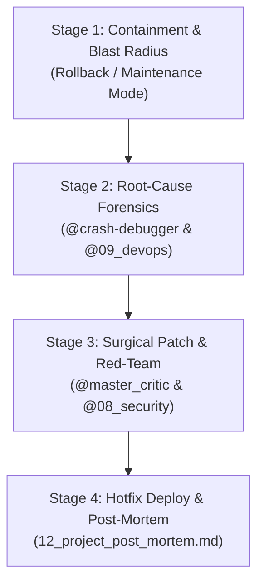

# 🚨 Scenario Runbook: Emergency Incident Response (P0 Outage / Crash)

**Objective:** Rapidly diagnose, isolate, fix, test, and deploy emergency patches for critical production outages, data corruption, or unhandled crash loops.

---

## 👥 Assigned Agent Squad

| Role | Agent File | Primary Mission |
| :--- | :--- | :--- |
| **DevOps & SRE Lead** | `@09_devops_sre_engineer.md` | Contain the blast radius, rollback if necessary, and inspect logs |
| **Crash Debugger** | `@crash-debugger.md` | Perform root-cause analysis on stack traces and error payloads |
| **Security Auditor** | `@08_security_auditor.md` | Verify the incident is not an active exploitation or zero-day breach |
| **Master Critic** | `@master_critic.md` | Stress-test the proposed patch for unintended regressions |

---

## ⚡ 4-Stage Triage Flow

### Stage 1: Immediate Containment (Minutes 0–15)
1. Assess system availability: Can traffic be rerouted, or is a rollback to the previous stable release required?
2. If database is involved, immediately trigger point-in-time backup.

### Stage 2: Root-Cause Diagnosis (Minutes 15–45)
1. Provide error stack trace, Sentry link, or cloud logs to the agent:
   > *"Run `@crash-debugger.md` on this error log: [PASTE STACK TRACE]. Identify the exact failing file, line number, and triggering edge case."*
2. Isolate whether the issue is:
   - Null pointer / unhandled promise rejection
   - Database connection pool exhaustion / deadlock
   - Third-party API outage / timeout
   - Corrupted state / invalid payload

### Stage 3: Surgical Hotfix & Adversarial Review (Minutes 45–75)
1. Generate the minimal surgical patch (no broad refactoring during an outage):
   > *"Draft a targeted hotfix for [file]. Ensure graceful fallbacks and timeout guards."*
2. Red-Team the fix:
   > *"Act as `@master_critic.md`. Audit this hotfix to prove whether it can cause secondary side effects or performance regressions under high concurrency."*

### Stage 4: Hotfix Deployment & Post-Mortem (Minutes 75–120)
1. Deploy hotfix to production.
2. Monitor error tracking dashboard for 15 minutes to verify error rate returns to 0%.
3. Document the incident in `.agency/active/product_design/12_project_post_mortem.md`.

---

## ✅ Definition of Done (DoD)
1. Production error rate returns to baseline (`< 0.01%`).
2. Automated regression test added to prevent recurrence of this exact error scenario.
3. Post-mortem document completed with timeline, root cause, and 3 preventive action items.
