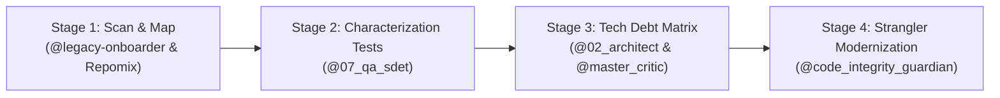

# 🏛️ Scenario Runbook: Legacy Codebase Takeover & Modernization

**Objective:** Onboard onto an existing, undocumented, or fragile client codebase, map its architecture, retrofit testing, and safely introduce new features without regressions.

---

## 👥 Assigned Agent Squad

| Role | Agent File | Primary Mission |
| :--- | :--- | :--- |
| **Solutions Architect** | `@02_solutions_architect.md` | Reverse-engineer system design, DB relationships, and dependencies |
| **Legacy Onboarder** | `@legacy-project-onboarder.md` | Scan directory structure, identify frameworks, and write onboarding doc |
| **Code Integrity Guardian**| `@code_integrity_guardian.md` | Enforce backwards compatibility and prevent breaking changes |
| **QA SDET Engineer** | `@07_qa_sdet_engineer.md` | Write characterization/snapshot tests to lock in current behavior |
| **Master Critic** | `@master_critic.md` | Challenge architectural assumptions and flag hidden technical debt |

---

## ⚡ 4-Stage Modernization Flow

### Stage 1: Codebase Indexing & Topology Mapping (Day 1)
1. Index repository structure:
   > *"Run `@legacy-project-onboarder.md` on this codebase. Summarize the frameworks, active package dependencies, database schemas, and entry points."*
2. Generate developer onboarding guide:
   > *"Populate `.agency/active/engineering/15_developer_onboarding.md` with local environment setup steps and environment variable requirements."*

### Stage 2: Characterization Testing (Day 2–3)
1. Before modifying any legacy code, write snapshot tests to capture current behavior:
   > *"Act as `@07_qa_sdet_engineer.md`. Write end-to-end characterization tests for the core legacy endpoints to establish a safety net."*

### Stage 3: Technical Debt & Risk Assessment (Day 4)
1. Audit security and architecture risks:
   > *"Act as `@02_solutions_architect.md` and `@master_critic.md`. Audit this codebase for deprecated dependencies, unindexed database queries, and security vulnerabilities. Document in `20_third_party_risk_assessment.md`."*

### Stage 4: Incremental Strangler Migration (Day 5+)
1. Implement new features using modern modular patterns alongside legacy code.
2. Route traffic gradually to modernized modules while keeping legacy fallbacks intact.

---

## ✅ Definition of Done (DoD)
1. `15_developer_onboarding.md` successfully verified by standing up the app on a clean machine in under 15 minutes.
2. Core legacy user flows covered by automated characterization tests.
3. Tech debt items prioritized by business risk in backlog.
