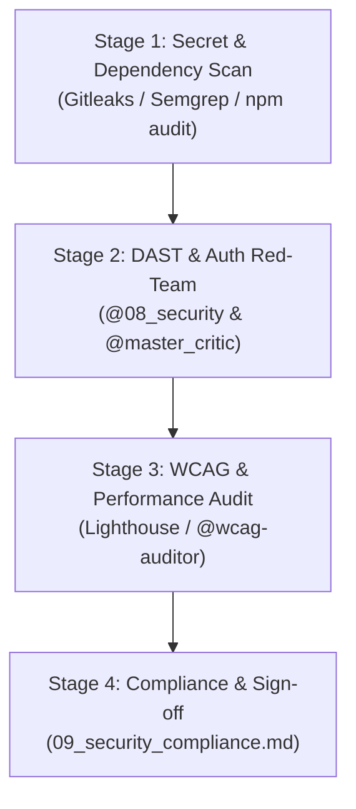

# 🛡️ Scenario Runbook: Pre-Launch Security & Quality Hardening

**Objective:** Execute an exhaustive security, accessibility, and performance audit before exposing a production application to public traffic or enterprise client review.

---

## 👥 Assigned Agent Squad

| Role | Agent File | Primary Mission |
| :--- | :--- | :--- |
| **Security Auditor** | `@08_security_auditor.md` | Execute SAST/DAST vulnerability scans, RLS audits, and secret detection |
| **QA SDET Engineer** | `@07_qa_sdet_engineer.md` | Run full automated E2E test suites and load tests |
| **Accessibility Auditor**| `@wcag-accessibility-auditor.md`| Audit frontend for WCAG 2.1 AA compliance |
| **Master Critic** | `@master_critic.md` | Adversarial red-team testing to attempt privilege escalation |
| **DevOps SRE Lead** | `@09_devops_sre_engineer.md` | Verify backup restoration, TLS configuration, and rate limiting |

---

## ⚡ 4-Stage Hardening Flow

### Stage 1: Static Code & Dependency Audit
1. Audit for exposed secrets and vulnerable dependencies:
   > *"Run `@08_security_auditor.md` on the repository. Check for hardcoded API keys, outdated npm/pip packages with known CVEs, and insecure environment variable fallbacks."*

### Stage 2: Authorization & Business Logic Red-Teaming
1. Audit multi-tenant isolation and IDOR vulnerabilities:
   > *"Act as `@master_critic.md` and `@08_security_auditor.md`. Red-team the database Row-Level Security (RLS) policies and API endpoint authorization checks. Attempt to craft an IDOR payload that accesses another tenant's records."*

### Stage 3: Accessibility & Core Web Vitals Audit
1. Audit client UI accessibility:
   > *"Run `@wcag-accessibility-auditor.md` on all frontend templates. Verify high contrast ratios, form `aria-label` tags, and keyboard focus states."*
2. Verify production build bundle size and Core Web Vitals benchmarks.

### Stage 4: Production Runbook & Compliance Sign-off
1. Verify database automated daily backups and point-in-time recovery.
2. Complete and sign off `09_security_compliance.md` and `19_accessibility_audit_wcag.md`.

---

## ✅ Definition of Done (DoD)
1. Zero 🔴 Critical or High severity vulnerabilities in static/dynamic scans.
2. All multi-tenant queries enforce strict tenant ID checks.
3. WCAG 2.1 AA compliance verified across all public and authenticated screens.
4. Disaster recovery point-in-time restore tested and documented.
