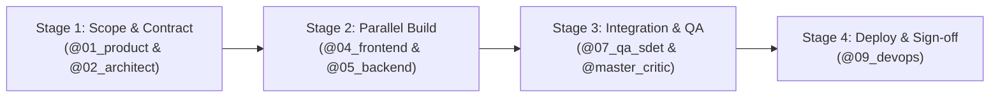

# 🚀 Scenario Runbook: Rapid MVP Launch (Greenfield Sprint)

**Objective:** Accelerate an idea from concept to a tested, working fullstack MVP in an compressed timeframe without skipping critical architectural foundations.

---

## 👥 Assigned Agent Squad

| Role | Agent File | Primary Mission |
| :--- | :--- | :--- |
| **Product Lead** | `@01_product_manager.md` | Define lean user stories, MVP scope boundary, and PRD |
| **UI/UX Designer** | `@03_ui_ux_designer.md` | Establish 8pt grid, design tokens, and core user flows |
| **Solutions Architect**| `@02_solutions_architect.md`| Design DB schema, OpenAPI contracts, and tech stack |
| **Frontend Engineer** | `@04_frontend_engineer.md` | Build responsive UI components with mock API data |
| **Backend Engineer** | `@05_backend_engineer.md` | Implement REST/GraphQL endpoints, DB queries, and auth |
| **SDET QA Engineer** | `@07_qa_sdet_engineer.md` | Write Playwright E2E tests for the core conversion flow |
| **Master Critic** | `@master_critic.md` | Red-team architecture and identify MVP scope bloat |

---

## ⚡ 4-Stage Execution Flow

### Stage 1: Scope & Contract Definition (Hours 0–4)
1. **Intake & Scope:**
   > *"Act as `@01_product_manager.md`. Draft a 1-page PRD (`03_requirements_engineering.md`) focused strictly on the single core MVP value proposition."*
2. **OpenAPI Architecture Contract:**
   > *"Act as `@02_solutions_architect.md`. Generate the database schema and typed OpenAPI contracts in `04_system_design_architecture.md`."*
3. **Critic Review:**
   > *"Act as `@master_critic.md`. Audit the PRD and Architecture to cut non-essential features."*

### Stage 2: Parallel Build Fork (Hours 4–24)
- **Frontend Stream:**
  > *"Act as `@04_frontend_engineer.md` and `@03_ui_ux_designer.md`. Build the client UI in `src/` following the OpenAPI contract with typed mock data."*
- **Backend Stream:**
  > *"Act as `@05_backend_engineer.md` and `@06_database_engineer.md`. Implement the database schema migrations and API controllers matching the OpenAPI contract."*

### Stage 3: Integration & Quality Gate (Hours 24–30)
1. Wire frontend API clients to live backend endpoints.
2. Write automated smoke tests:
   > *"Act as `@07_qa_sdet_engineer.md`. Write a Playwright E2E test verifying the complete user signup, checkout, and core action flow."*

### Stage 4: Staging Deployment (Hours 30–36)
1. Deploy to preview environment (Vercel / Fly.io / Render).
2. Human Lead performs 5-minute visual walkthrough and signs off.

---

## ✅ Definition of Done (DoD)
1. The primary user loop works end-to-end without console errors.
2. All inputs validated with Zod/Pydantic schemas.
3. Database migrations executed and seeded with demo data.
4. Playwright smoke test passes with 0 failures.
