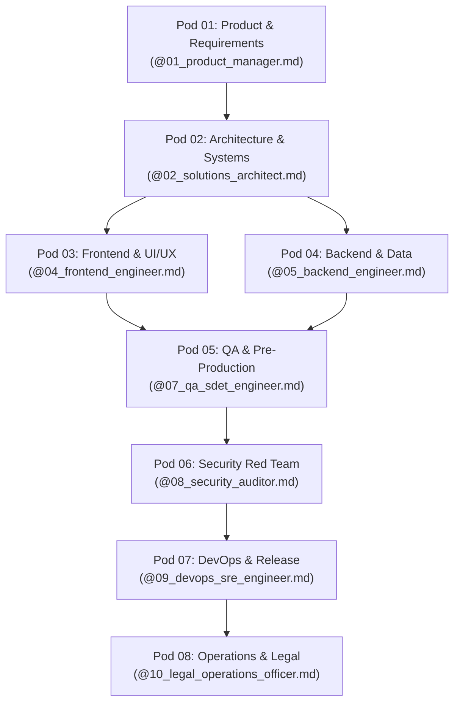

# Master Engineering Departments Directory (TEAMS.md)

This directory organizes all AI agents, specialized skills, and deliverable templates into **8 dedicated industry-standard engineering departments**. 

Summon any department lead directly by referencing their role charter in `.agency/agents/`.

---

## The 8 Department Pods & Canonical Roles

| Pod | Department Name | Canonical Lead Role File | Owned Skills | Core Deliverables |
| :--- | :--- | :--- | :--- | :--- |
| **01** | **Product & Requirements** | [`01_product_manager.md`](file:///C:/Users/Md%20Ganim/Desktop/agency_playbook/.agency/agents/01_product_manager.md) | `prd-discovery-agent`, `client-intake-parser`, `business-model-analyst`, `proposal-pricing-calculator` | SOW (`01`), PRD (`03`), Intake (`13`), Change Orders (`14`) |
| **02** | **Architecture & Systems** | [`02_solutions_architect.md`](file:///C:/Users/Md%20Ganim/Desktop/agency_playbook/.agency/agents/02_solutions_architect.md) | `tech-stack-adviser`, `architecture-diagrammer`, `repowise-codebase-mapper` | System Design HLD/LLD (`04`), Developer Onboarding (`15`) |
| **03** | **Frontend & UI/UX** | [`03_ui_ux_designer.md`](file:///C:/Users/Md%20Ganim/Desktop/agency_playbook/.agency/agents/03_ui_ux_designer.md) & [`04_frontend_engineer.md`](file:///C:/Users/Md%20Ganim/Desktop/agency_playbook/.agency/agents/04_frontend_engineer.md) | `senior-designer-ui`, `skillui-generator`, `wcag-accessibility-auditor`, `impeccable`, `android-cli` | UI/UX Handoff (`10`), WCAG Audit (`19`), Client UI Code |
| **04** | **Backend & Data Systems** | [`05_backend_engineer.md`](file:///C:/Users/Md%20Ganim/Desktop/agency_playbook/.agency/agents/05_backend_engineer.md) & [`06_database_engineer.md`](file:///C:/Users/Md%20Ganim/Desktop/agency_playbook/.agency/agents/06_database_engineer.md) | `supabase-database-audit`, Prisma/SQL migrations, Zod API Validation | SDLC Execution (`05`), DB Migrations, API Controllers |
| **05** | **QA & Pre-Production** | [`07_qa_sdet_engineer.md`](file:///C:/Users/Md%20Ganim/Desktop/agency_playbook/.agency/agents/07_qa_sdet_engineer.md) | `testing-coverage-audit`, `performance-audit`, `observability-audit`, Playwright test runner | Testing & UAT Sign-off (`06`), Automated Test Suites |
| **06** | **Security & Red Team** | [`08_security_auditor.md`](file:///C:/Users/Md%20Ganim/Desktop/agency_playbook/.agency/agents/08_security_auditor.md) & [`challenger_critic.md`](file:///C:/Users/Md%20Ganim/Desktop/agency_playbook/.agency/agents/challenger_critic.md) | `strix-security-auditor`, `security-audit`, `devils-advocate-critic` | Security Compliance (`09`), Risk Assessment (`20`), DAST Pentests |
| **07** | **DevOps & Release** | [`09_devops_sre_engineer.md`](file:///C:/Users/Md%20Ganim/Desktop/agency_playbook/.agency/agents/09_devops_sre_engineer.md) | `deployment-cicd-audit`, `crash-debugger`, `bootstrap.sh`, `validate_phase.py` | Deployment Runbook (`07`), Disaster Recovery (`17`), CI/CD Pipelines |
| **08** | **Operations & Legal** | [`10_legal_operations_officer.md`](file:///C:/Users/Md%20Ganim/Desktop/agency_playbook/.agency/agents/10_legal_operations_officer.md) | `legal-risk-flagging`, `client-update-generator`, `legacy-project-onboarder`, `brand-identity-architect` | MSA (`02`), SLA (`08`), GTM (`11`), Post-Mortem (`12`), Handoff (`16`), DPA (`18`) |

---

## Contract-First Pipeline Flow

